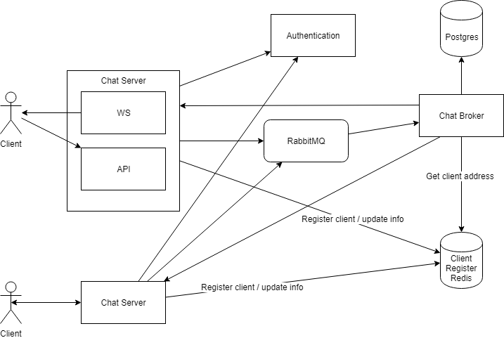

# Chat Server

> Note: This is a project for my own testing purposes

Server for a chat application.

### Diagram



### Getting Started

```sh
$ docker-compose build
$ docker-compose up
```

Redis
```sh
$ docker run -p 6379:6379 --name some-redis -d redis
```

RabbitMQ
```sh
$ docker run -d --hostname my-rabbit --name some-rabbit -p 5672:5672 -p 15672:15672 rabbitmq:3-management
```

```sh
docker start some-redis && docker start some-rabbit
docker stop some-redis && docker stop some-rabbit
```

### Notes

#### TODO

*
* 

#### Redis Commander

https://www.npmjs.com/package/redis-commander

```sh
$ npm install -g redis-commander
$ redis-commander
```

http://localhost:8081/

##### ChatServer

##### Broker / RabbitMQ

##### ClientRegister / Redis

##### Authentication


```
New client online:
 Authenticate
 Send update to client register
 Check if there is waiting messages for the client in the sent_queu

Server: New Message
 Validate
 Send update to client register
 Send message to broker

Broker: New message
 Get receiver server from client register
 Send to correct server
 Save message to sent_queue

Server: New receiver message
 Send to reveiver with WebSocket
 Send status to broker (success/fail)

Broker: Received message
 Remove message from sent_queue


```

#### Routing

Routes: https://docs.microsoft.com/en-us/aspnet/core/fundamentals/routing?view=aspnetcore-2.1#id7

Route constraints: 
https://docs.microsoft.com/en-us/aspnet/core/fundamentals/routing?view=aspnetcore-2.1#route-constraint-reference


#### Performance

https://medium.com/@tampajohn/net-core-2-and-golang-797566350095

#### Integration tests

https://docs.microsoft.com/en-us/aspnet/core/test/integration-tests?view=aspnetcore-2.1#customize-webapplicationfactory

### Docker networking

https://runnable.com/docker/docker-compose-networking

https://docs.microsoft.com/en-us/dotnet/standard/microservices-architecture/multi-container-microservice-net-applications/multi-container-applications-docker-compose
